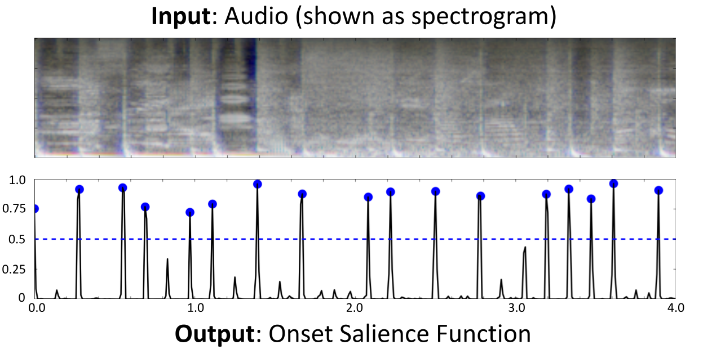

# Music onset detector from Dance Dance Convolution

This is a simple PyTorch port of the CNN-based music onset detector model from [Dance Dance Convolution](https://arxiv.org/abs/1703.06891), originally referred to in that work as the "step placement" model.

I am resurfacing this model now as **I suspect it may be useful for imbuing music audio generative models with fine-grained rhythmic control**. Specifically, it can be used to extract time-varying onset salience functions from audio, which may be a reasonable musical analogy to the [Canny edge detector](https://arxiv.org/abs/2302.05543) used to enable pixel-wise control in [ControlNet](https://arxiv.org/abs/2302.05543). A visual example:



## Example usage

## Model behavior

Empirically, while this model was trained for [a more specific task](#original-training), its behavior is that of an onset detector (_not_ a beat detector). In my experience, this model has solid recall both for drum and melodic onsets, though I have never attempted a formal comparison to [other onset detectors](https://madmom.readthedocs.io/en/v0.16/modules/features/onsets.html).

The raw 100Hz onset salience function predicted by the model may be useful as a control signal for conditional generative models of music audio. Additionally, onsets can be discretized using simple a [peak finding algorithm](https://docs.scipy.org/doc/scipy/reference/generated/scipy.signal.find_peaks.html) (blue dots in above image), and precision / recall can be refined by thresholding peaks (dashed blue line). In the context of controllable generative models, thresholding may be useful for improving generalization to user-specified onset controls.

## Original training

This model was trained on data from the rhythm game Dance Dance Revolution. Specifically, it was trained as a binary classifer to predict whether or not each audio frame (100 per second) should correspond to the presence of a player action in the game (a "step").

Another input to the model during training was a user-specified "difficulty" (1-5), corresponding to difficulties assigned by level designers in the original game. The hope at the time was that the model could learn to adjust predictions based on a user's skill level. This never really worked that well and isn't particularly relevant for onset detection. Hence, this input is set to the highest difficulty by default, but the option is there if you want to play with this setting.

This model was [originally implemented and trained in TensorFlow](https://github.com/chrisdonahue/ddc/blob/master/learn/onset_net.py). I ported that ugly implementation to a clean PyTorch one a few years back as part of the process of building [Beat Sage](https://beatsage.com).

## Citing this work

If you end up using this for anything, please cite the original DDC paper.

```
@inproceedings{donahue2017ddc,
  title={{Dance Dance Convolution}},
  author={Donahue, Chris and Lipton, Zachary C and McAuley, Julian},
  booktitle={ICML},
  year={2017},
}
```
